# Agentic Workflow Diagrams

## High-Level Workflow

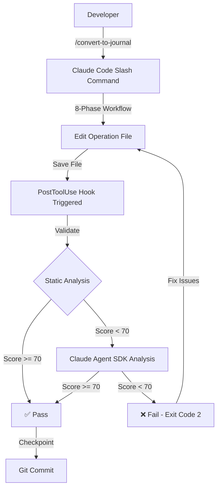

## Detailed Validation Flow

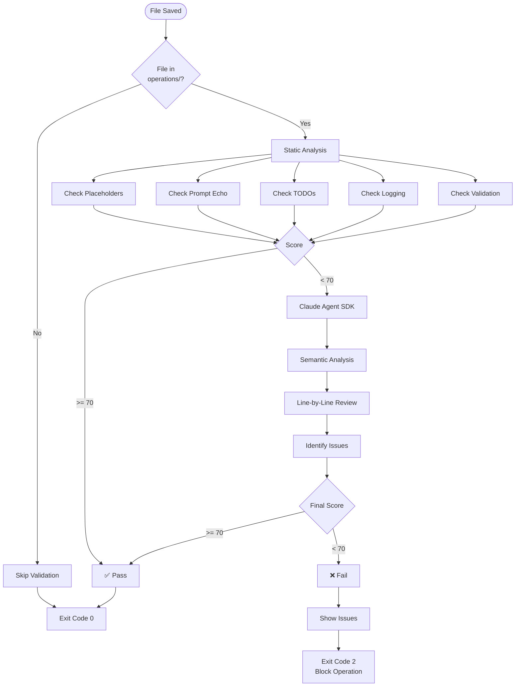

## Validation Scoring System

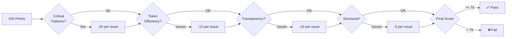

## Anti-Pattern Detection

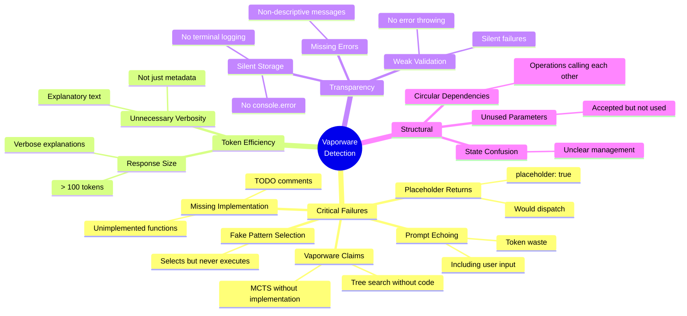

## Structured Journal Pattern

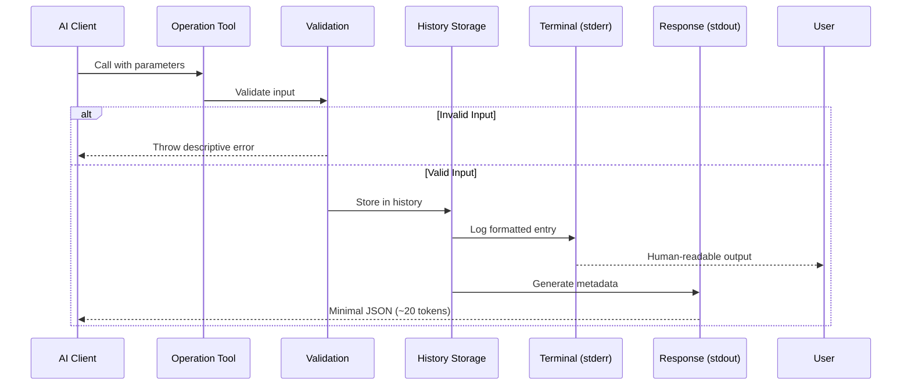

## Conversion Workflow Phases

```mermaid
gantt
    title Operation Conversion Workflow
    dateFormat X
    axisFormat %s
    
    section Phase 1
    Analysis & Planning           :a1, 0, 1
    
    section Phase 2
    Define Interface              :a2, 1, 1
    
    section Phase 3
    Implement Validation          :a3, 2, 1
    
    section Phase 4
    Implement Storage             :a4, 3, 1
    
    section Phase 5
    Terminal Formatting           :a5, 4, 1
    
    section Phase 6
    Tool Description              :a6, 5, 1
    
    section Phase 7
    Remove Vaporware              :a7, 6, 1
    
    section Phase 8
    Testing                       :a8, 7, 1
```

## Component Architecture

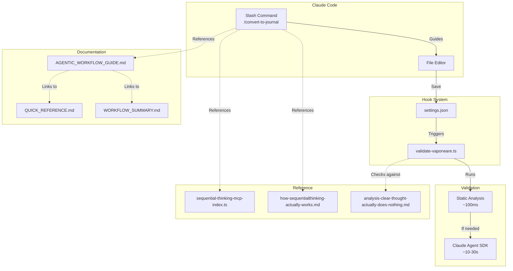

## Data Flow

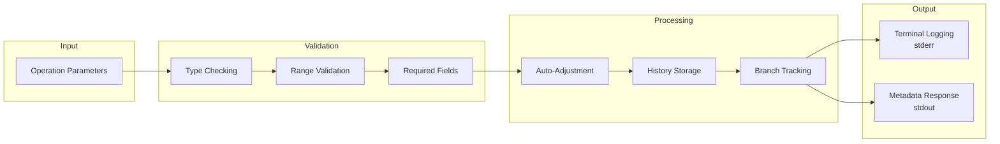

## Success Criteria Checklist

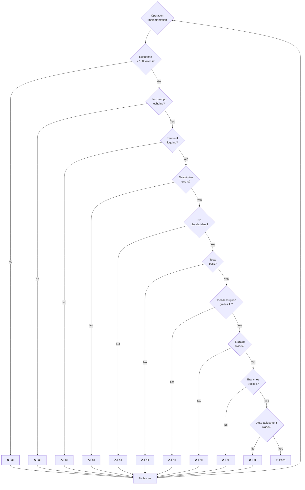

## Hook Execution Timeline

```mermaid
gantt
    title Hook Execution Timeline
    dateFormat X
    axisFormat %Lms
    
    section Detection
    File Change Detected          :0, 10
    
    section Static Analysis
    Read File                     :10, 20
    Regex Checks                  :30, 30
    Structural Analysis           :60, 20
    Score Calculation             :80, 10
    
    section Decision
    Check Score                   :90, 5
    
    section Claude SDK (if needed)
    Initialize SDK                :95, 500
    Send to Claude                :595, 5000
    Receive Analysis              :5595, 2000
    Parse Results                 :7595, 100
    
    section Output
    Format Results                :7695, 50
    Display to User               :7745, 50
    Exit                          :7795, 5
```

## Integration Points

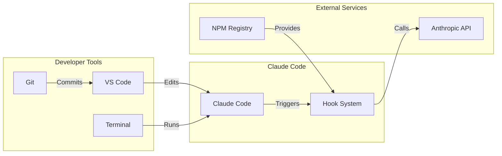

## Legend

- 🟢 **Green**: Success/Pass
- 🔴 **Red**: Failure/Block
- 🟡 **Yellow**: Warning/Review
- 🔵 **Blue**: Process/Action
- ⚪ **White**: Decision Point

