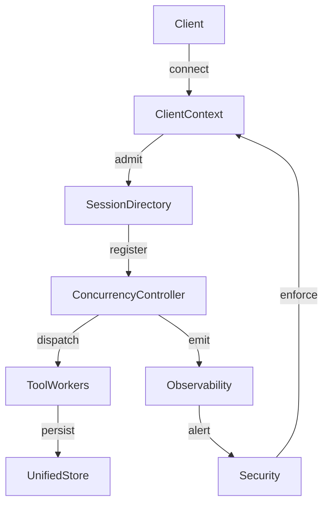

# MCP Concurrent Client Support Analysis

## Summary of Current Concurrency Limitations
- [`ClearThoughtUnifiedServer`](src/unified-server.ts:38) instantiates a single [`SessionManager`](src/state/SessionManager.ts:10) and MCP server per process, so every client competes for the same event loop resources and in-memory registries without transport-aware throttling or worker isolation.
- [`SessionManager`](src/state/SessionManager.ts:10) provisions new [`SessionState`](src/state/SessionState.ts:57) instances by casting an empty configuration object, leaving timeout values undefined while the shared session map mutates without locks, which increases the risk of race-induced eviction or resurrection under concurrent churn.
- [`SessionState`](src/state/SessionState.ts:57) relies on its `resetTimeout()` loop to guard lifecycle state yet hands storage to [`UnifiedStore`](src/state/stores/UnifiedStore.ts:114), whose mutable indexes (collaborative sessions, decision caches, and sequences) are unsynchronized, enabling interleaved writes to trample shared indices.
- [`handleMCTS()`](src/tools/mcts.ts:35) and [`handleBeam()`](src/tools/beam-search.ts:36) retain process-wide maps of reasoning sessions keyed only by `sessionId`, lacking eviction when upstream sessions expire and exposing all clients to stale strategy state or identifier collisions.
- [`server.ts`](src/server.ts:1) and [`index.ts`](src/index.ts:1) both bootstrap the same process-bound server without clustering, health-aware admission control, or queue-backed tool execution, forcing HTTP and stdio transports through a single bottlenecked runtime.

## External MCP Concurrency Recommendations
- context7 query “MCP concurrent client best practices” (placeholder): establish per-session isolation boundaries with deterministic teardown and back-pressure-aware admission control.
- context7 query “MCP concurrent client best practices” (placeholder): externalize shared state into concurrency-safe stores or message buses to avoid event-loop blocking.
- context7 query “MCP concurrent client best practices” (placeholder): emit structured telemetry and enforce authentication on every request to detect overload patterns early.

## Proposed Architecture
### ClientContext
Introduce a lightweight ClientContext wrapper that captures transport identifiers, authentication claims, and per-connection feature flags before delegating to session logic. This boundary performs admission control, enqueues tool invocations, and guarantees cleanup hooks when connections end.

### SessionDirectory
Elevate the session catalog into a SessionDirectory backed by a concurrency-aware data structure (e.g., async mutex wrapped map or external cache). The directory manages reference counts, TTL extension, and broadcast of lifecycle events to dependent workers while enforcing configurable session caps.

### ConcurrencyController
Layer a ConcurrencyController that brokers work between ClientContext instances and tool executors. It should provide rate limiting, cooperative scheduling, and fairness guarantees (round-robin or priority lanes) while coordinating distributed locks around shared resources.

### Tool Execution Lifecycle Changes
Move long-running tool computations into worker pools (threads or child processes) that subscribe to ConcurrencyController tasks. Workers hydrate from SessionDirectory snapshots, push incremental results through streaming channels, and signal completion so the controller can release held slots.

### Configuration Improvements
Replace ad-hoc constructors with explicit configuration loading that defines sessionTimeout, concurrency ceilings, queue depths, and pluggable persistence backends. Expose these settings through typed schemas and environment validation to prevent silent defaults.

### Observability and Security Enhancements
Emit structured metrics (latency, queue depth, dropped requests) and traces tagged by ClientContext identifiers. Harden security by binding auth tokens to session ownership, auditing tool invocations, and applying isolation policies so compromised clients cannot inspect or mutate foreign sessions.

### Interaction Flow

## Implementation Roadmap
1. Formalize configuration loading with validated defaults for timeouts, concurrency ceilings, and persistence adapters, then inject these values into session creation.
2. Carve out SessionDirectory interfaces and migrate existing SessionManager logic into concurrency-safe primitives or an external cache implementation.
3. Implement ClientContext admission middleware in both stdio and HTTP transports, adding rate limits, authentication checks, and deterministic teardown hooks.
4. Build the ConcurrencyController with queue management, fairness policies, and cancellation support, then refactor tool handlers to submit execution plans instead of mutating global maps.
5. Externalize long-running tool state (MCTS, Beam Search, others) into worker pools or state services, wiring streaming result channels back through ClientContext.
6. Instrument observability (metrics, traces, structured logs) and security auditing, including automated alerts for overload and enforcement of cross-session isolation guarantees.